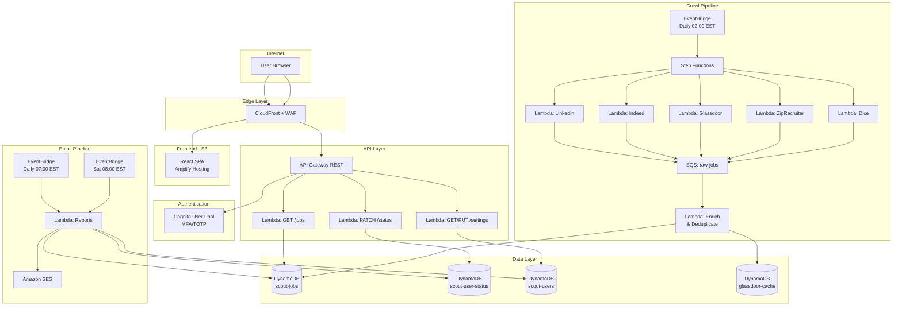

# Scout — Job Aggregation & Application Tracker

## System Design Document

**Version:** 1.0
**Date:** April 9, 2026
**Author:** Jay (Firewall Engineer → AWS)
**Status:** Draft — Architecture Definition

---

## 1. Problem Statement

Manually searching LinkedIn, Indeed, Glassdoor, and other job boards daily for senior security/cloud architecture roles is time-consuming and error-prone. There's no unified view of postings, no tracking of application status, and no automated alerting when new high-value roles appear.

**Scout** solves this by crawling major job boards daily, deduplicating results, enriching them with Glassdoor ratings, and presenting everything in a secure, filterable web dashboard with application tracking and automated email reports.

---

## 2. Requirements

### 2.1 Functional Requirements

| ID | Requirement |
|----|-------------|
| FR-1 | Daily crawl of LinkedIn, Indeed, Glassdoor, ZipRecruiter, and Dice for job postings |
| FR-2 | Target roles: Security Engineer, Security Architect, Solutions Architect, Network Security Architect, Cloud Security Architect, Cloud Architect, CISO, Deputy CISO, VP of Security |
| FR-3 | Location filter: Atlanta, GA metro area OR US Remote |
| FR-4 | Salary filter: ≥ $180,000/year |
| FR-5 | Listing data: Role Name, Company, Location, Salary Range, PTO Days, Sick Days, 401k Match, Benefits Summary, Posting Date, Source URL, Glassdoor Rating |
| FR-6 | Application status tracking per user per posting: Not Applied Yet, Applied, Recruiter Interview, Technical Interview, Offer Received, Offer Accepted |
| FR-7 | Filters: Last 24h, Last 7 Days, Last 30 Days, Company Rating range |
| FR-8 | Auto-purge postings older than 60 days |
| FR-9 | Daily new-postings email report |
| FR-10 | Weekly application-status email report — Saturday 8:00 AM EST |
| FR-11 | Multi-user support with per-user dashboards |

### 2.2 Non-Functional Requirements

| ID | Requirement |
|----|-------------|
| NFR-1 | Authentication: Cognito with MFA (TOTP) |
| NFR-2 | Available on the public internet (HTTPS only) |
| NFR-3 | Minimal cost (handful of users) |
| NFR-4 | Data refreshed daily; crawl window: 02:00–05:00 EST |
| NFR-5 | HTTPS/TLS everywhere, least-privilege IAM |
| NFR-6 | Infrastructure as Code (CDK or Terraform) |

---

## 3. High-Level Architecture

```
┌─────────────────────────────────────────────────────────────────────────────┐
│                              INTERNET                                       │
└──────────────────────────────┬──────────────────────────────────────────────┘
                               │
                    ┌──────────▼──────────┐
                    │   CloudFront (CDN)   │
                    │   + WAF              │
                    └──────────┬──────────┘
                               │
              ┌────────────────┼────────────────┐
              │                │                │
    ┌─────────▼────────┐  ┌───▼────────┐  ┌───▼──────────┐
    │  S3 (React SPA)  │  │  Cognito   │  │  API Gateway  │
    │  Static Hosting   │  │  User Pool │  │  (REST)       │
    └──────────────────┘  │  + MFA     │  └───┬──────────┘
                          └────────────┘      │
                                              │ JWT Auth
                          ┌───────────────────┼───────────────────┐
                          │                   │                   │
                ┌─────────▼──────┐  ┌────────▼───────┐  ┌───────▼────────┐
                │  Lambda:       │  │  Lambda:       │  │  Lambda:       │
                │  GET /jobs     │  │  PATCH /status │  │  GET /reports  │
                │  (list/filter) │  │  (app status)  │  │  (on-demand)   │
                └─────────┬──────┘  └────────┬───────┘  └───────┬────────┘
                          │                  │                   │
                          └──────────┬───────┘───────────────────┘
                                     │
                          ┌──────────▼──────────┐
                          │   DynamoDB          │
                          │   - Jobs table      │
                          │   - UserStatus table │
                          │   - Users table      │
                          └─────────────────────┘


   ═══════════════════ CRAWL PIPELINE (ASYNC) ═══════════════════

   ┌──────────────┐     ┌──────────────┐     ┌───────────────────┐
   │ EventBridge  │────▶│  Step        │────▶│  Lambda: Crawl    │
   │ Cron Rule    │     │  Functions   │     │  (per source)     │
   │ 02:00 EST    │     │  Orchestrate │     │  LinkedIn, Indeed │
   └──────────────┘     └──────┬───────┘     │  Glassdoor, Zip,  │
                               │             │  Dice              │
                               │             └────────┬──────────┘
                               │                      │
                               │             ┌────────▼──────────┐
                               │             │  SQS: Raw Jobs    │
                               │             │  Queue             │
                               │             └────────┬──────────┘
                               │                      │
                               │             ┌────────▼──────────┐
                               │             │  Lambda: Enrich   │
                               │             │  - Deduplicate    │
                               │             │  - Normalize      │
                               │             │  - Glassdoor      │
                               │             │    Rating Lookup  │
                               │             └────────┬──────────┘
                               │                      │
                               │             ┌────────▼──────────┐
                               │             │  DynamoDB: Jobs   │
                               │             └───────────────────┘
                               │
                               │  ┌──────────────────────────────┐
                               └─▶│  Lambda: Purge (TTL-based)   │
                                  │  Remove postings > 60 days    │
                                  └──────────────────────────────┘


   ═══════════════════ EMAIL PIPELINE ═══════════════════

   ┌──────────────┐     ┌───────────────┐     ┌────────────┐
   │ EventBridge  │────▶│ Lambda:       │────▶│   SES      │
   │ Daily 07:00  │     │ Daily Report  │     │   Email    │
   │ Sat 08:00    │     │ Weekly Report │     │   Delivery │
   └──────────────┘     └───────────────┘     └────────────┘
```

---

## 4. Component Deep Dive

### 4.1 Frontend — React + AWS Amplify

**Stack:** React 18, TypeScript, Tailwind CSS, AWS Amplify SDK

**Why React + Amplify:** Amplify provides drop-in Cognito authentication components (sign-up, sign-in, MFA enrollment) with zero custom auth code. The Amplify Hosting service deploys from a Git repo with CI/CD built in.

**Key Pages:**

| Page | Description |
|------|-------------|
| `/login` | Cognito Hosted UI or Amplify Authenticator component with TOTP MFA |
| `/dashboard` | Main job listing table with filters, sort, and application status dropdowns |
| `/settings` | User email preferences, notification toggles |

**Filter Bar Components:**
- Date range selector: Last 24h / Last 7 Days / Last 30 Days (radio or pill buttons)
- Glassdoor rating slider: 1.0 – 5.0 (range input)
- Application status multi-select: filter by your tracking status
- Keyword search: free-text across role name and company
- Sort: by date posted, salary (desc), rating (desc)

**Job Card / Table Row Fields:**
```
┌──────────────────────────────────────────────────────────────────────┐
│ Role Name          │ Company      │ Location │ Salary    │ Rating   │
│ Cloud Sec Architect│ Acme Corp    │ Remote   │ $190-220k │ ★ 4.2   │
├──────────────────────────────────────────────────────────────────────┤
│ PTO: 20d │ Sick: 10d │ 401k: 6% │ Benefits: Medical/Dental/Vision │
├──────────────────────────────────────────────────────────────────────┤
│ Posted: Apr 8, 2026  │  Source: LinkedIn  │  [View Posting ↗]       │
├──────────────────────────────────────────────────────────────────────┤
│ Status: [ Not Applied Yet ▾ ]                                        │
└──────────────────────────────────────────────────────────────────────┘
```

### 4.2 Authentication — Amazon Cognito

**Configuration:**
- User Pool with email as primary identifier
- MFA: Required, TOTP-based (authenticator app — Google Authenticator, Authy, etc.)
- Password policy: minimum 12 chars, mixed case, number, special char
- Self-registration enabled (optionally gated with admin approval for invite-only)
- JWT tokens: ID token + Access token, 1-hour expiry, refresh token 30-day expiry
- Cognito authorizer on API Gateway validates JWTs automatically

**Why Cognito over alternatives:** Native AWS integration, free tier covers 50,000 MAUs (massive overkill for this use case), built-in MFA, and Amplify's `<Authenticator>` component handles the entire auth flow in ~10 lines of React.

### 4.3 API Layer — API Gateway + Lambda

**API Gateway:** REST API (not HTTP API) — REST supports Cognito authorizers natively, WAF integration, and request validation.

**Endpoints:**

```
GET    /jobs?dateRange={24h|7d|30d}&minRating={float}&status={enum}&sort={field}&page={n}
GET    /jobs/{jobId}
PATCH  /jobs/{jobId}/status       body: { "status": "Applied" }
GET    /reports/daily
GET    /reports/weekly
GET    /user/settings
PUT    /user/settings             body: { "email": "...", "notifications": {...} }
```

**Lambda Runtime:** Python 3.12 (familiar ecosystem for scraping libs, boto3 native)

**Lambda Configuration:**
- Memory: 256 MB for API handlers, 512 MB for crawlers
- Timeout: 30s for API handlers, 5 min for crawlers (per source)
- Provisioned concurrency: not needed at this scale
- Layers: shared layer with `requests`, `beautifulsoup4`, `boto3`

### 4.4 Data Store — DynamoDB

**Why DynamoDB:** Serverless, zero maintenance, pay-per-request pricing ideal for low-traffic. Single-digit millisecond reads. TTL feature handles automatic 60-day purge for free.

#### Table: `scout-jobs`

| Attribute | Type | Description |
|-----------|------|-------------|
| `PK` | String | `JOB#<normalized_hash>` — hash of (title + company + location) for dedup |
| `SK` | String | `SOURCE#<source>#<source_id>` |
| `roleName` | String | Job title |
| `company` | String | Hiring company name |
| `location` | String | City, State or "Remote" |
| `salaryMin` | Number | Minimum salary (annual) |
| `salaryMax` | Number | Maximum salary (annual) |
| `ptoDays` | Number | PTO days (null if unavailable) |
| `sickDays` | Number | Sick days (null if unavailable) |
| `match401k` | String | e.g., "6% match" (null if unavailable) |
| `benefits` | String | Summary text |
| `postedDate` | String | ISO 8601 date |
| `sourceUrl` | String | Direct link to the original posting |
| `source` | String | "linkedin" / "indeed" / "glassdoor" / "ziprecruiter" / "dice" |
| `glassdoorRating` | Number | Company rating 1.0–5.0 |
| `glassdoorUrl` | String | Link to Glassdoor company page |
| `createdAt` | String | ISO 8601 — when Scout first saw this posting |
| `ttl` | Number | Unix epoch — `createdAt + 60 days` (DynamoDB auto-deletes) |

**GSI-1 (DateIndex):** `PK=JOBS`, `SK=postedDate` — enables date-range queries.
**GSI-2 (RatingIndex):** `PK=JOBS`, `SK=glassdoorRating` — enables rating-based sorting.

#### Table: `scout-user-status`

| Attribute | Type | Description |
|-----------|------|-------------|
| `PK` | String | `USER#<cognito_sub>` |
| `SK` | String | `JOB#<normalized_hash>` |
| `status` | String | Enum: NOT_APPLIED, APPLIED, RECRUITER_INTERVIEW, TECHNICAL_INTERVIEW, OFFER_RECEIVED, OFFER_ACCEPTED |
| `updatedAt` | String | ISO 8601 |
| `notes` | String | Optional user notes |

**GSI-1 (StatusIndex):** `PK=USER#<sub>`, `SK=status` — filter by application status.

#### Table: `scout-users`

| Attribute | Type | Description |
|-----------|------|-------------|
| `PK` | String | `USER#<cognito_sub>` |
| `email` | String | For email reports |
| `dailyReport` | Boolean | Opt-in daily emails |
| `weeklyReport` | Boolean | Opt-in weekly emails |
| `createdAt` | String | ISO 8601 |

### 4.5 Crawl Pipeline — Step Functions + Lambda + SQS

This is the core data engine. It runs daily at 02:00 EST via EventBridge.

```
EventBridge (cron: 0 7 * * ? *)   ← 07:00 UTC = 02:00 EST
        │
        ▼
Step Functions State Machine
        │
        ├─── Parallel Branch ──────────────────────────┐
        │    ┌─────────┐ ┌─────────┐ ┌──────────────┐ │
        │    │ Crawl   │ │ Crawl   │ │ Crawl        │ │
        │    │LinkedIn │ │Indeed   │ │Glassdoor     │ │
        │    └────┬────┘ └────┬────┘ └──────┬───────┘ │
        │         │           │              │         │
        │    ┌────┴───┐ ┌────┴────┐ ┌──────┴───────┐ │
        │    │ Crawl  │ │ Crawl   │ │ (more srcs)  │ │
        │    │ZipRecr │ │ Dice    │ │              │ │
        │    └────┬───┘ └────┬────┘ └──────┬───────┘ │
        │         │           │              │         │
        └─────────┴───────────┴──────────────┘─────────┘
                              │
                     ┌────────▼────────┐
                     │   SQS Queue:    │
                     │   raw-jobs      │
                     └────────┬────────┘
                              │
                     ┌────────▼────────┐
                     │  Lambda:        │
                     │  Enrich &       │
                     │  Deduplicate    │
                     └────────┬────────┘
                              │
                     ┌────────▼────────┐
                     │  DynamoDB       │
                     │  scout-jobs     │
                     └─────────────────┘
```

**Crawl Strategy per Source:**

| Source | Method | Details |
|--------|--------|---------|
| **LinkedIn** | Guest Jobs API (`/jobs-guest/`) | Public endpoint, no login required. Parse HTML response. Rate-limit to 1 req/3s. |
| **Indeed** | Public search pages via scraping API (ScrapeOps or ScrapingBee as proxy) | Indeed is aggressive with bot detection. A scraping proxy service handles CAPTCHA and IP rotation. |
| **Glassdoor** | GraphQL cache intercept or Apify actor | Medium difficulty. Use managed scraper for reliability. |
| **ZipRecruiter** | Public API (`/api/jobs`) | More open than others. Standard REST parsing. |
| **Dice** | Public search API | Tech-focused board, straightforward JSON responses. |

**Search Queries per Crawl (parameterized):**
```python
ROLE_QUERIES = [
    "Security Engineer",
    "Security Architect",
    "Solutions Architect",
    "Network Security Architect",
    "Cloud Security Architect",
    "Cloud Architect",
    "CISO",
    "Chief Information Security Officer",
    "Deputy CISO",
    "VP Information Security",
]

LOCATION_QUERIES = [
    {"location": "Atlanta, GA", "radius": "25mi"},
    {"location": "United States", "remote": True},
]

SALARY_MINIMUM = 180000
```

**Enrichment Lambda Logic:**
1. Receive raw job from SQS
2. Normalize fields (title casing, salary string → min/max integers, date parsing)
3. Compute `normalized_hash = sha256(lower(title) + lower(company) + lower(location))`
4. DynamoDB `PutItem` with `ConditionExpression: attribute_not_exists(PK)` → deduplicates
5. If new job → look up Glassdoor rating for company via a cached ratings table (avoid hitting Glassdoor per job)
6. Set `ttl = int(time.time()) + (60 * 86400)`

**Glassdoor Rating Cache:**
A separate `scout-glassdoor-cache` DynamoDB table stores company → rating mappings with a 7-day TTL. The enrichment Lambda checks the cache first; on miss, it triggers an async Glassdoor lookup and backfills.

### 4.6 Email Reports — EventBridge + Lambda + SES

**Daily Report (07:00 EST / every day):**
- Query `scout-jobs` for postings with `createdAt` in the last 24 hours
- Format as an HTML email with a table of new postings
- Send via SES to all users where `dailyReport = true`

**Weekly Report (Saturday 08:00 EST):**
- Query `scout-user-status` for each user
- Group by status (Applied, Interviewing, Offers)
- Format as HTML email with application pipeline summary
- Include counts: X new postings this week, Y applications, Z interviews scheduled
- Send via SES to all users where `weeklyReport = true`

**SES Configuration:**
- Verified domain (not just email) for production deliverability
- DKIM + SPF + DMARC configured on the domain
- Sending rate: trivial — well within SES free tier (62,000/month from EC2, or $0.10/1000 otherwise)

### 4.7 Security Architecture

```
┌─────────────────────────────────────────────────┐
│                  SECURITY LAYERS                 │
├─────────────────────────────────────────────────┤
│                                                  │
│  Edge:       CloudFront + AWS WAF               │
│              - Rate limiting (100 req/5min/IP)  │
│              - SQL injection rules              │
│              - Geo-restriction (US only, opt.)  │
│              - HTTPS only (TLS 1.2+)            │
│                                                  │
│  Auth:       Cognito + MFA (TOTP)               │
│              - JWT validation on every API call  │
│              - Token refresh via Amplify SDK     │
│                                                  │
│  API:        API Gateway + Cognito Authorizer   │
│              - Request throttling               │
│              - Request validation schemas        │
│                                                  │
│  Compute:    Lambda                              │
│              - Least-privilege IAM roles         │
│              - No VPC (no need, reduces cost)    │
│              - Environment variables via SSM     │
│              - Secrets (API keys) in Secrets Mgr │
│                                                  │
│  Data:       DynamoDB                            │
│              - Encryption at rest (AWS-managed)  │
│              - IAM-based access (no public)      │
│              - Point-in-time recovery enabled     │
│                                                  │
│  Email:      SES                                 │
│              - DKIM + SPF + DMARC                │
│              - Verified sending domain           │
│                                                  │
│  Secrets:    API keys for scraping services      │
│              stored in AWS Secrets Manager        │
│              Rotated every 90 days               │
│                                                  │
│  Monitoring: CloudWatch Alarms on:               │
│              - Crawl Lambda errors               │
│              - API 5xx rate                      │
│              - DynamoDB throttling               │
│              - SES bounce rate                   │
│                                                  │
└─────────────────────────────────────────────────┘
```

### 4.8 Infrastructure as Code

**Recommended:** AWS CDK (TypeScript) — strongly typed, great Amplify/Cognito L2 constructs, and aligns with the React/TypeScript frontend.

**CDK Stack Structure:**
```
scout-infra/
├── bin/
│   └── scout.ts                  # App entry point
├── lib/
│   ├── scout-auth-stack.ts       # Cognito User Pool, MFA config
│   ├── scout-api-stack.ts        # API Gateway, Lambda functions
│   ├── scout-data-stack.ts       # DynamoDB tables, GSIs
│   ├── scout-crawl-stack.ts      # Step Functions, SQS, crawl Lambdas
│   ├── scout-email-stack.ts      # SES, EventBridge rules, report Lambdas
│   ├── scout-frontend-stack.ts   # S3, CloudFront, WAF
│   └── scout-monitoring-stack.ts # CloudWatch dashboards, alarms, SNS
├── lambda/
│   ├── crawlers/
│   │   ├── linkedin.py
│   │   ├── indeed.py
│   │   ├── glassdoor.py
│   │   ├── ziprecruiter.py
│   │   └── dice.py
│   ├── enrichment/
│   │   └── enrich_and_deduplicate.py
│   ├── api/
│   │   ├── get_jobs.py
│   │   ├── update_status.py
│   │   └── user_settings.py
│   ├── reports/
│   │   ├── daily_report.py
│   │   └── weekly_report.py
│   └── shared/
│       ├── models.py
│       ├── glassdoor_cache.py
│       └── ses_client.py
├── frontend/
│   └── scout-app/                # React + Amplify app
├── cdk.json
└── package.json
```

---

## 5. Cost Estimate (Monthly — Low Traffic)

| Service | Usage | Estimated Cost |
|---------|-------|---------------|
| **Cognito** | < 50,000 MAU | **Free** |
| **DynamoDB** | On-demand, ~10K items, ~50K reads/month | **~$1–2** |
| **Lambda** | ~200 invocations/day (crawl + API) | **Free tier** |
| **API Gateway** | ~3K requests/month | **~$0.01** |
| **Step Functions** | ~30 state transitions/day | **Free tier** |
| **SQS** | ~500 messages/day | **Free tier** |
| **S3 + CloudFront** | Static site, minimal traffic | **~$1** |
| **SES** | ~50 emails/month | **~$0.01** |
| **WAF** | 1 WebACL + managed rules | **~$6** |
| **Secrets Manager** | 2–3 secrets | **~$1.20** |
| **CloudWatch** | Logs + 3 alarms | **~$2** |
| **Scraping proxy** (ScrapeOps/ScrapingBee) | ~5K requests/month | **~$29** (starter plan) |
| **Route 53** | 1 hosted zone | **$0.50** |
| **Domain** | .com registration | **~$1/mo amortized** |
| **Total** | | **~$40–45/month** |

The scraping proxy is the dominant cost. Self-managed scraping (rotating residential proxies) could lower this but increases maintenance.

---

## 6. Trade-off Analysis

### Decisions Made

| Decision | Alternative Considered | Why This Choice |
|----------|----------------------|-----------------|
| **DynamoDB** over RDS/Aurora | Aurora Serverless v2 | DynamoDB is truly serverless with zero idle cost. The data model is simple key-value with known access patterns. RDS would add $15+/mo minimum even when idle. |
| **Step Functions** over bare EventBridge→Lambda | Direct Lambda fan-out | Step Functions give visual execution history, retry policies per step, and error handling. Minimal cost difference at this scale. |
| **Scraping proxy service** over self-managed proxies | Bright Data residential proxies | Managed service handles CAPTCHA, IP rotation, and anti-bot for you. Higher per-request cost but dramatically lower engineering effort. |
| **REST API Gateway** over HTTP API | HTTP API is cheaper | REST API supports native Cognito authorizers and WAF. HTTP API would require a Lambda authorizer (more code, more latency). Price difference is negligible at this volume. |
| **Amplify Hosting** over S3+CloudFront manual | Manual S3 deployment | Amplify adds Git-based CI/CD for free. One `git push` deploys. Can always eject later. |
| **SES** over SendGrid | SendGrid free tier | SES is native AWS, no additional vendor, and free for the first 62K emails/month when sent from Lambda. |
| **Best-effort Glassdoor scrape** over paid API | Glassdoor partner API | Glassdoor's partner API requires enterprise licensing. Best-effort scrape with a 7-day cache is good enough — missing ratings can be displayed as "N/A." |

### Risks & Mitigations

| Risk | Impact | Mitigation |
|------|--------|------------|
| **Job board anti-bot changes** | Crawl failure for one or more sources | Use a scraping proxy that handles anti-bot. Architect each crawler as an independent Lambda — one breaking doesn't affect others. CloudWatch alarm on crawl failures. |
| **LinkedIn ToS enforcement** | Account ban, IP block | Only scrape guest/public endpoints (no login). Use scraping proxy for IP rotation. No PII collection. |
| **Salary data often missing** | Incomplete listings | Display "Not disclosed" in UI. Over time, consider SalaryRange API enrichment from Glassdoor/Levels.fyi. |
| **Benefits data rarely structured** | PTO/401k fields often empty | Parse what's available. Set expectations in UI with "—" for unavailable fields. Future: LLM parsing of job descriptions to extract benefits. |
| **DynamoDB hot partition** | Throttling during crawl burst | On-demand billing absorbs bursts. Crawl Lambda writes are spread across unique PKs (job hashes), so no single hot key. |

---

## 7. Future Enhancements (V2+)

- **LLM-powered job description parsing:** Use Bedrock (Claude) to extract structured benefits data (PTO, 401k, etc.) from unstructured job descriptions.
- **Salary estimation:** When salary isn't listed, use Levels.fyi or Glassdoor salary data to estimate a range.
- **Job match scoring:** Score each posting against a user-defined profile (skills, preferences) using embeddings.
- **Interview prep integration:** When status changes to "Technical Interview," auto-generate company-specific prep materials.
- **Mobile push notifications:** SNS push for high-match new postings.
- **Resume tailoring:** Auto-adjust resume keywords per posting using Bedrock.

---

## 8. Deployment Sequence

| Phase | Components | Duration |
|-------|-----------|----------|
| **Phase 1** | CDK project scaffold, Cognito + Amplify auth, DynamoDB tables, basic React shell with login | 1 week |
| **Phase 2** | Crawl pipeline (LinkedIn + Indeed first), enrichment Lambda, SQS queue | 1 week |
| **Phase 3** | API Gateway + Lambda handlers, frontend dashboard with filters | 1 week |
| **Phase 4** | Glassdoor rating enrichment, remaining crawlers (Glassdoor, Zip, Dice) | 1 week |
| **Phase 5** | Email reports (SES), EventBridge schedules, application status tracking | 3–4 days |
| **Phase 6** | WAF, monitoring, CloudWatch alarms, domain/DNS setup, production hardening | 3–4 days |

**Total estimated build time:** ~5–6 weeks (evenings/weekends pace)

---

## 9. Mermaid Architecture Diagram


